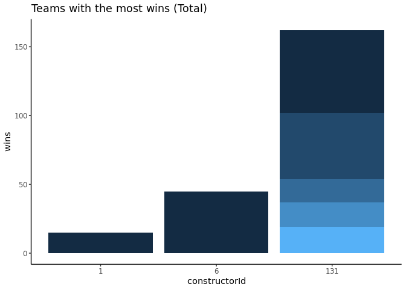

Final Project
================
Adrian Ortiz, Juan Ramirez JR

    Rows: 8953 Columns: 9
    ── Column specification ────────────────────────────────────────────────────────
    Delimiter: ","
    chr (3): q1, q2, q3
    dbl (6): qualifyId, raceId, driverId, constructorId, number, position

    ℹ Use `spec()` to retrieve the full column specification for this data.
    ℹ Specify the column types or set `show_col_types = FALSE` to quiet this message.

    Warning: One or more parsing issues, see `problems()` for details

    Rows: 12626 Columns: 7
    ── Column specification ────────────────────────────────────────────────────────
    Delimiter: ","
    dbl (7): constructorStandingsId, raceId, constructorId, points, position, po...

    ℹ Use `spec()` to retrieve the full column specification for this data.
    ℹ Specify the column types or set `show_col_types = FALSE` to quiet this message.
    Rows: 211 Columns: 5
    ── Column specification ────────────────────────────────────────────────────────
    Delimiter: ","
    chr (4): constructorRef, name, nationality, url
    dbl (1): constructorId

    ℹ Use `spec()` to retrieve the full column specification for this data.
    ℹ Specify the column types or set `show_col_types = FALSE` to quiet this message.

## Introduction

Description of data and problem(s) you are solving. Include data
source(s) here, either through citation or link to webpage. \>Question
1: Of the fastest drivers in Qualifying Round #3, who has the most wins
in Abu Dhabi? \>Question 2: Which team had the most wins in the 2021
season?

## Graphic 1

Provide a brief description of your goal with your created graphic and
what it demonstrates

For this problem, we are trying to find out which of the fastest drivers
in Qualifying round #3 had the most wins in a specific course: Abu
Dhabi. We chose Abu Dhabi because it is one of the more complex and
iconic circuits in F1, not to mention the final circuit in most F1
seasons.  
We take some data from the Q3 times for each driver. We decided to skip
Q1 and Q2 because we were ONLY interested in drivers who were fast
enough to survive the first two rounds of qualifying and move on the the
third and final round.  
We started by removing any values which were marked NULL which usually
indicate some sort of mechanical failure or other issue that took a
driver out of Q3. We then take a look at the number of total wins these
drivers had.

The end result is graphic for the fastest Q3 drivers compared by total
wins.

<!-- -->
\> The fastest driver from Q3 with the most wins in Abu Dhabi is
driverId #18, which is Jenson Button.

## Graphic 2 - Which team has the most all-time wins?

Provide a brief description of your goal with your created graphic and
what it demonstrates

For this graphic, we wanted to see which F1 team currently has the most
wins all-time. In order to do this, we needed to look at the provided
“constructor_standings” data set to determine who has the most wins.  
We did notice that there are some teams without wins, so we had to
remove those first before we could sort the data in order.  
The end result is a nice depiction of the top three teams in F1 to-date:
The top team is Mercedes, followed by Ferrari, and finally McLaren.
<!-- -->
